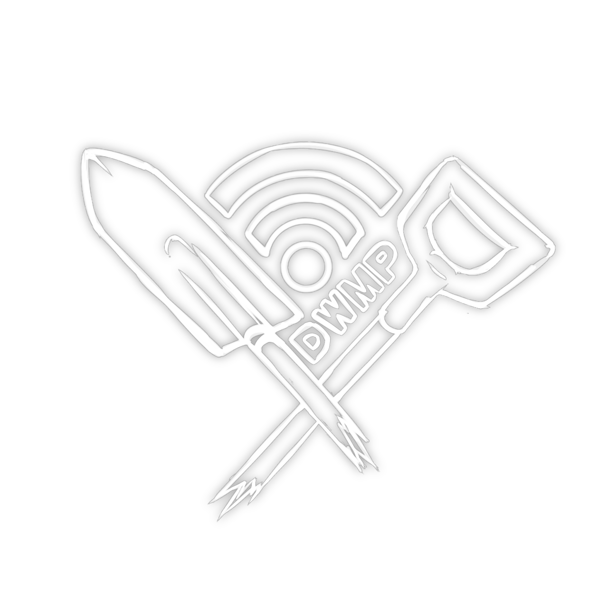

  

# 🌒 Darkwood Ghost Multiplayer (DWMP)

> **Фанатский мультиплеерный мод для игры Darkwood.**

DWMP позволяет нескольким игрокам видеть друг друга в одном и том же мире. Каждый играет в своём сохранении, но видит остальных игроков в реальном времени.

### 🔧 Как работает:
- Один игрок — хост, другие подключаются по IP (через Radmin VPN или Hamachi).
- Каждый игрок создаёт своё собственное сохранение, в котором будет играть.
- После синхронизации ваших миров вы видите других игроков в реальном времени.

---

## 🌒 Darkwood Ghost Multiplayer (DWMP)

> **A fan-made multiplayer mod for the game Darkwood.**

DWMP allows several players to see each other in the same world. Each player plays using their own save file, but sees other players in real time.

### 🔧 How it works:
- One player hosts, others connect via IP (using Radmin VPN or Hamachi).
- Each player creates their own save file to play in.
- After syncing your worlds, you’ll see other players in real time.

---

> ⚠️ This is an unofficial, fan-made mod. We are not affiliated with the developers of Darkwood.
